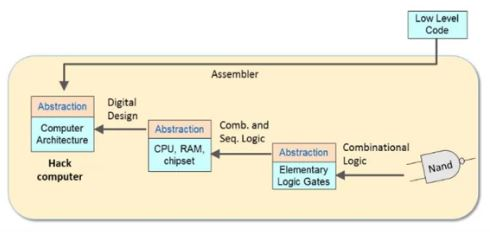

# Building a computer

A project to learn all levels of abstraction that work under the hood of a modern computer.

***

## Hardware:

### Starting off with a NAND gate:
We can build literally all the chips needed for the computer using NAND gates alone. Chip-set required to be built for the project is as follows.
|Class|Chips|Tested|
|-----|-----|------|
|Elementary|not, and, or, xor, mux, demux|YES|
|16-bit|not16, and16, or16, mux16|YES|
|Multi-way|or8way, mux4way16, mux8way16, demux4way, demux8way|YES|
|ALU parts|half-adder, full-adder, adder16, incrementer|YES|
|-|arithmetic logic unit|YES|
***

### Sequential logic:
We will use only the D flip-flop (clocked) for our sequential circuits.
|Class|Chips|Tested|
|-----|-----|------|
|Registers|1-bit, 16-bit, counter|YES|
|RAM|8 word, 64 word, 512 word, 4k word, 16k word|YES|
***